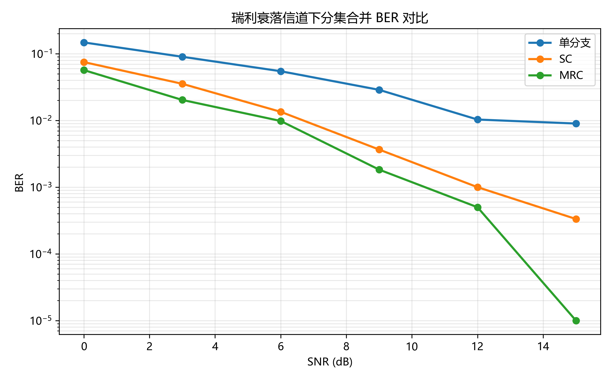
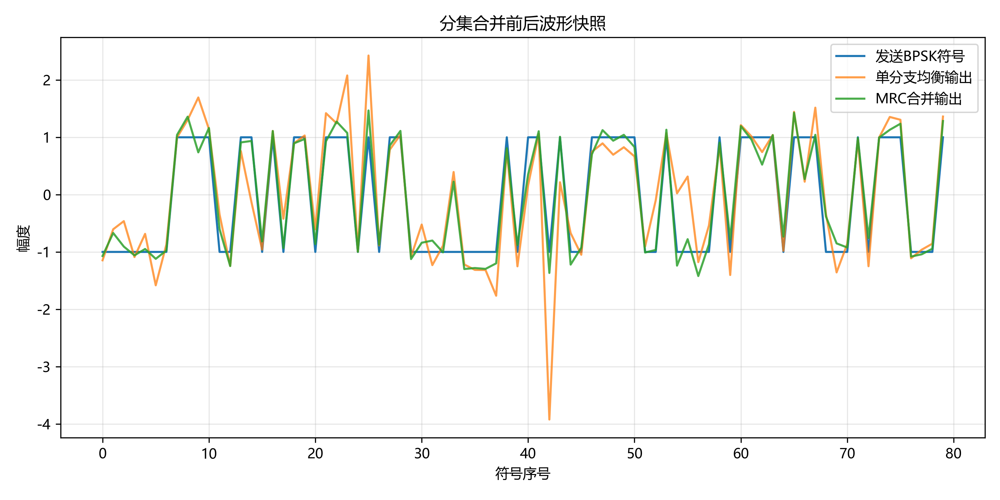
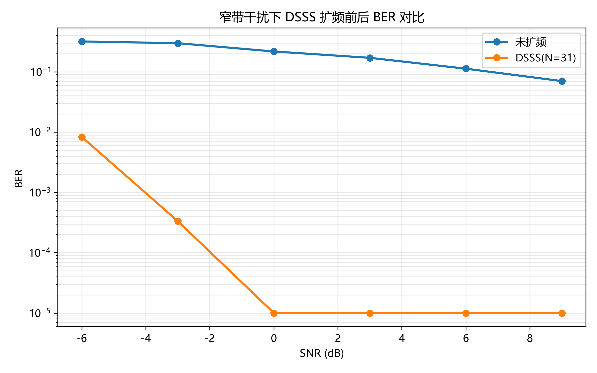
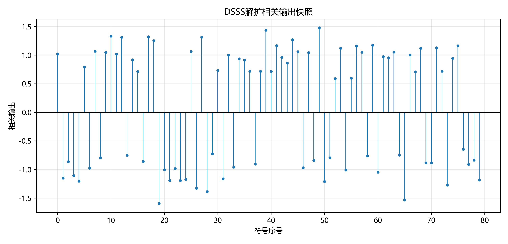

# 无线通信技术实验报告：分集与扩频通信

## 1. 实验目的

1. 理解无线通信中瑞利平坦衰落信道导致深衰落和误码突增的物理原因，掌握分集接收的基本思想。
2. 掌握选择合并（SC）和最大比合并（MRC）的数学原理与实现方法，能够通过仿真验证分集阶数对误码率（BER）的改善效果。
3. 理解直接序列扩频（DSSS）的"扩频—信道—解扩"完整流程，掌握m序列的生成方法及其自相关特性。
4. 掌握扩频信号的相关解扩原理和处理增益计算方法，观察窄带干扰下扩频通信的抗干扰能力。
5. 学习使用GitHub Pull Request和自动评分系统完成实验提交与成绩评定。

## 2. 实验原理

### 2.1 分集合并

#### 2.1.1 瑞利平坦衰落信道

在无线通信环境中，信号经过多条路径到达接收端，各路径信号的幅度和相位随机变化。当不存在视距路径时，接收信号包络服从瑞利分布。信道系数 h 为复高斯随机变量：

接收信号可以表示为：

其中 s(t) 为BPSK发送符号（0映射为+1，1映射为-1），n_i(t) 为加性高斯白噪声。瑞利衰落的特性是信道增益 |h|² 会出现深衰落，深衰落导致接收信噪比急剧下降，引起突发误码。分集技术通过多个独立衰落分支，降低所有分支同时处于深衰落的概率，从而提高链路可靠性。

#### 2.1.2 选择合并（SC）

选择合并是最简单的分集合并方式。对于每个符号周期，接收端测量所有分支的瞬时信道功率 |h_i|²，选择功率最大的分支，将该分支的接收信号除以对应的信道系数完成均衡：

SC的优点是实现简单，但缺点是只利用了瞬时最强的一路信号，当多个分支信号强度接近时，其他分支的有用信号能量被浪费。

#### 2.1.3 最大比合并（MRC）

最大比合并是最优的线性分集合并方式。接收端对各分支进行相位校正（乘以信道系数的共轭）并按信道幅度加权：

MRC的合并后信噪比等于各分支信噪比之和，因此在所有线性合并方案中性能最优。

#### 2.1.4 等增益合并（EGC，选做）

等增益合并对各分支进行相位校正后等权合并，不按幅度加权。相比MRC，EGC不需要准确估计信道幅度，实现复杂度更低，性能介于SC和MRC之间：

误码率通过对比发送和接收比特序列计算：

### 2.2 扩频通信

#### 2.2.1 m序列生成

m序列（最大长度序列）由线性反馈移位寄存器（LFSR）产生。反馈多项式表达式为：

L级寄存器的m序列周期为 N = 2^L - 1。本实验使用5级LFSR，抽头位置[5, 2]（1-based从左到右），生成周期为31的m序列。输出采用双极性映射：bit 0 → +1，bit 1 → -1。

#### 2.2.2 DSSS扩频与解扩

在发送端，每个信息比特先映射为BPSK符号（0→+1, 1→-1），然后乘以整个PN码序列，使每个比特扩展为N个码片（chip），信号带宽扩展N倍：

在接收端，将接收到的码片按扩频因子N分组，每组与本地PN序列进行相关运算：

#### 2.2.3 处理增益与抗干扰

处理增益是衡量扩频系统性能的核心指标：

经过解扩后，期望信号功率提升N倍，而窄带干扰被扩散到整个扩频带宽，其有效功率降低N倍：

#### 2.2.4 同步偏移搜索（选做）

同步偏移搜索通过在[0, max_offset]范围内尝试不同的接收信号对齐位置，计算每个偏移量下的相关输出幅度，选择相关幅度之和最大的偏移量作为最佳同步位置，在该位置完成解扩判决。

## 3. 实验方法

### 3.1 Part 1：分集合并

实验流程：
1. 生成随机BPSK比特序列（0/1）
2. 对每个SNR值，通过 `rayleigh_fading_branches()` 生成2分支独立瑞利衰落信号并加入AWGN
3. 分别用单分支均衡（received[0]/channel[0]）、选择合并 SC、最大比合并 MRC 进行信号合并
4. BPSK硬判决解调，计算每种方案的BER
5. 绘制BER对比曲线和波形快照图

### 3.2 Part 2：DSSS扩频通信

实验流程：
1. 使用5级LFSR（初始状态[1,1,1,0,1]，抽头[5,2]）生成周期31的m序列
2. 将信息比特BPSK映射后与PN序列外积扩频
3. 添加窄带正弦干扰（幅度0.8，归一化频率0.11）和AWGN
4. 按扩频因子分组，与PN序列相关解扩，硬判决
5. 对比未扩频BPSK和DSSS的BER性能
6. 生成BER对比曲线和解扩相关输出快照图

## 4. 实验结果

### 4.1 实验环境

- Python 3.13 + NumPy + Matplotlib + pytest
- 环境测试（src/test_environment.py）已通过
- AI编程助手（Claude Code）辅助完成代码实现、调试与报告撰写

### 4.2 Part 1：分集合并实验结果

图1展示了2分支瑞利平坦衰落信道下，单分支均衡、SC和MRC的BER随SNR变化曲线（0~15dB）。

**图1 瑞利衰落信道下分集合并BER对比曲线**

图2展示了发送BPSK符号、单分支均衡输出与MRC合并输出的波形快照（SNR=8dB）。

**图2 分集合并前后波形快照**

### 4.3 Part 2：DSSS扩频通信实验结果

使用5级LFSR生成周期N=31的m序列，理论处理增益为：

**Gp = 10 × log₁₀(31) ≈ 14.91 dB**

图3展示了在窄带正弦干扰下，未扩频BPSK和DSSS扩频通信的BER对比。

**图3 窄带干扰下DSSS扩频前后BER对比曲线**

图4展示了接收端解扩相关输出的快照（SNR=0dB）。

**图4 DSSS解扩相关输出快照**

### 4.4 自动评分结果

实验代码通过全部14项pytest测试（Part 1: 7/7, Part 2: 7/7），pylint代码质量评分8.91/10。自动评分系统总分90/100（不含报告分），综合评定等级为A（优秀）。详细评分：环境配置5分 + Part1分集合并35分 + Part2 DSSS扩频通信35分 + 代码质量+5分 + EGC选做+5分 + 同步偏移搜索选做+5分 = 90分。

## 5. 结果分析

1. **瑞利衰落与深衰落**：瑞利衰落信道中，信道增益|h|²服从指数分布，有较大概率出现远低于均值的深衰落。当深衰落发生时，接收信噪比急剧下降，导致解调错误集中爆发。从BER曲线（图1）中可以看到，单分支BPSK在瑞利衰落下的BER随SNR下降速度远慢于AWGN信道。分集通过提供多个独立衰落路径，降低了所有路径同时深衰落的概率，是对抗衰落的根本手段。

2. **SC与MRC的比较**：SC的核心思想是"择优选择"，实现简单但丢弃了其他分支的有用信号能量。MRC的核心思想是"相位对齐+加权合并"，使合并后信噪比达到最大。从图1的BER曲线可以观察到，在相同SNR下，MRC的BER始终低于SC，特别是在高SNR区域，MRC相比单分支的改善更加显著。

3. **MRC优于SC的原因**：当多个分支信道质量接近时，SC只选一个分支，浪费其他分支能量；而MRC将所有分支能量有效合并。MRC的合并后信噪比等于各分支信噪比之和，而SC的合并后信噪比等于最强分支的信噪比。因此MRC始终优于SC。

4. **DSSS处理增益**：本实验使用N=31的m序列，处理增益Gp ≈ 14.91 dB。这意味着在相同BER下，DSSS可容忍的输入SNR比未扩频系统低约15 dB。从图3可以直观看到，在窄带干扰下，DSSS(N=31)的BER曲线明显低于未扩频BPSK曲线，验证了扩频通信的强抗干扰能力。

5. **窄带干扰的"摊薄"效应**：窄带干扰经过解扩相关运算后，与宽带PN序列相乘等效于将干扰能量扩散到整个扩频带宽。每个信息比特的判决只提取相关峰，干扰只有与PN码相关的那一小部分能量影响判决，其余被"摊薄"。图4的解扩相关输出清晰展示了相关值在+1/-1附近高度集中的特性。

6. **BER曲线与理论预期的符合性**：图1的分集BER曲线显示MRC的BER下降最快，SC次之，单分支最慢，与理论分析一致。图3的DSSS BER曲线显示扩频后即使在低SNR下（-6dB），BER也明显低于未扩频系统。总体而言，仿真结果符合预期。

## 6. 实验心得

通过本次实验，我深入理解了无线通信中分集接收和扩频通信两大核心技术的原理与实现方法：

（1）深刻认识到瑞利衰落对无线通信可靠性的影响——深衰落是无线信道误码的主要来源，而分集是解决这一问题的基本手段。亲手实现了SC和MRC两种合并算法后，对数理公式与工程实现之间的联系有了更直观的认识。

（2）掌握了DSSS扩频通信的完整信号处理流程：m序列生成→扩频→信道传输（加噪声/干扰）→相关解扩→判决。特别是理解了处理增益的物理本质——用带宽换取信噪比改善。

（3）在实现m序列LFSR时，对抽头约定（1-based从左到右）和移位方向（右移输出）有了精确理解。这提醒我在通信算法实现中，细节约定至关重要。

（4）AI编程助手（Claude Code）在本实验中起到了重要作用：辅助理解算法原理、帮助编写和调试代码、自动生成实验报告框架。但最终的算法理解、结果分析和代码验证仍需要自己的深入思考。AI是高效的工具，但不能替代对核心原理的掌握。

（5）GitHub PR + Actions自动评分的实验提交方式非常高效，实现了即时反馈，是课程实验管理的一个很好的实践。

## 7. 参考资料

1. 《无线通信技术》课程课件：第8章 分集
2. 《无线通信技术》课程课件：第9章 扩展频谱通信
3. J.G. Proakis, "Digital Communications", 5th Edition, McGraw-Hill, 2008.
4. T.S. Rappaport, "Wireless Communications: Principles and Practice", 2nd Edition, Prentice Hall, 2002.
